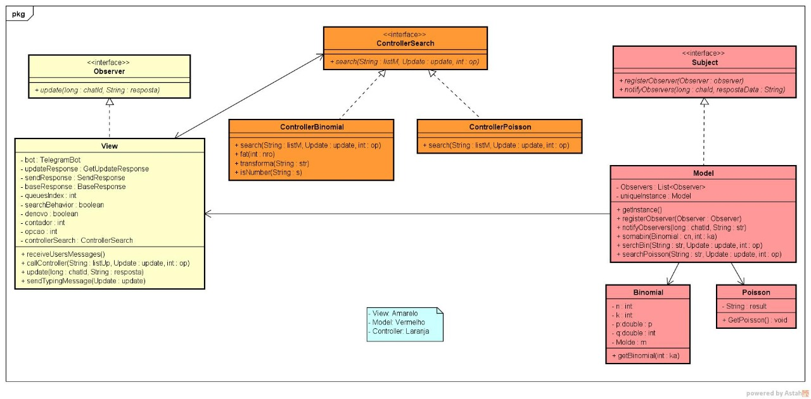
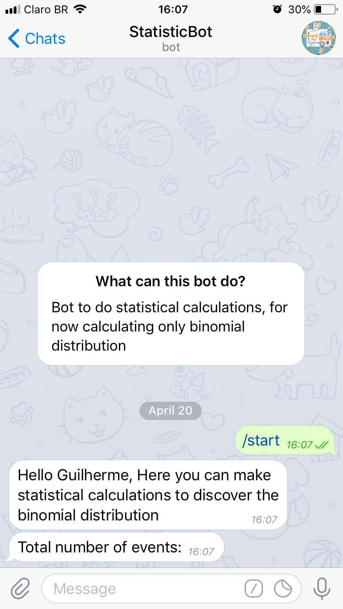
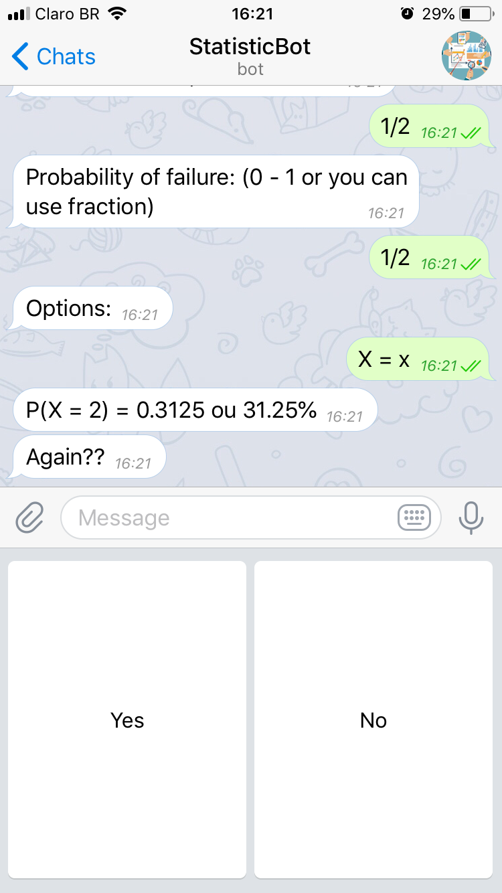

# StatisticBot
Projeto de Engenharia de Software usando MVC

> @StatisticsFatecBot
 

>> Bot para ajudar na Matéria de Estatistica Aplicada.
>> Realiza calculo de distribuição Binomial

---
### Tools:
>> Messaging app Telegram, Programming language JAVA (software architecture standard MVC), Gradle and Eclipse. 

---
### Class Diagram:

 

---
### The Bot:

 

 

#### BOT em execução, com opções de botões

 

 

 

