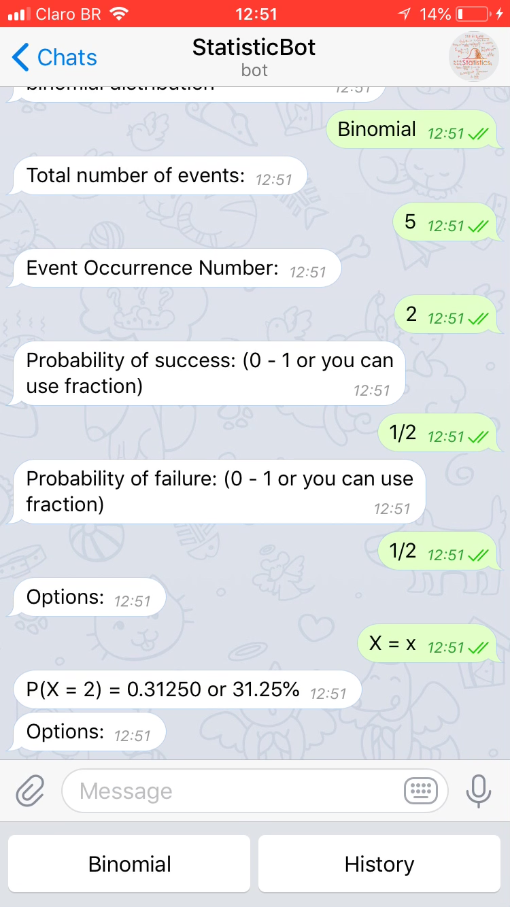

# StatisticBot

#### @botestatisticafatecbot
 

> Bot to do statistical calculations, for now calculating only binomial distribution

---
### Tools:
> Messaging app Telegram, Programming language JAVA (software architecture standard MVC), Gradle and Eclipse. 

---
### Class Diagram:

 

### To be implemented:
> - Algorithm to do other statistical calculations
> - Hosting in the Cloud Computing Heroku Environment

### Calculations:

> - P(X = k) = probability that the event takes place "k times" in "n evidence"
> - p = probability of success = probability that the event will take place in a single event
> - q = probability of failure = probability that the event will not occur during a test
> - n = total number of tests
> - k = number of times the event is wanted

 

---

### The Bot:

 

 

 

 

